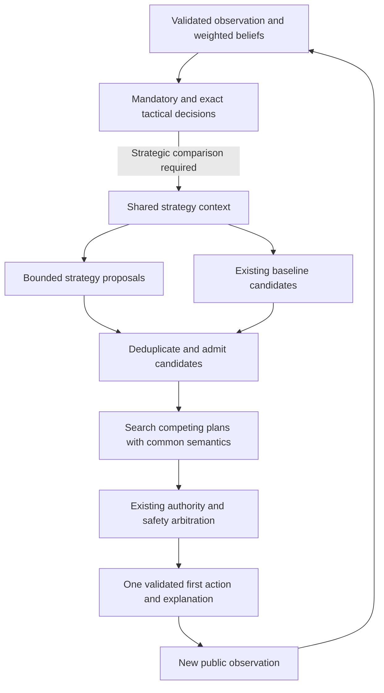

# Adaptive strategy layer for Colonist Assistant

Status: Revised design for review. Milestone 0 is implemented in the current working tree as a bounded pre-strategy baseline repair; it is not yet gameplay-evaluated, independently reviewed, committed or promoted. Milestones 1–6 remain proposed by this document.

Date: 2026-09-06. Source investigation began at `d80e4b40601411b6cb848471978dbe1799c2045a` and continued against the current working tree. This document does not claim demonstrated playing-strength improvement.

## 1. Objective

Allow the engine to consider several competing routes to victory and revise them as the game changes. Inputs include player count, seat order, victory target, dice model, production, legal building opportunities, resource and development-card beliefs, and opponent pressure.

The engine should answer:

> Which legal first action best preserves and advances my chance of reaching the victory target before the other players, given what I can currently know?

A strategy is a generator of concrete plans and alternatives. Examples are securing a contested settlement, growing city production, pursuing development-card points, acquiring an award, and completing a winning turn. A strategy does not own its own rules engine or directly click the UI.

The requested deliverable is this design. Implementation should follow a separately reviewed, bounded plan.

## 2. Existing behavior and the gaps this addresses

The following findings are based on source inspection, not new gameplay experiments:

| Existing component | Verified behavior | Design implication |
| --- | --- | --- |
| `src/worker/deep-search.ts` | Reconstructs development-card worlds; carries player order, victory target, dice identity and effort settings | Reuse its validated observation contract |
| `catan-core/src/state.rs::chance_weight` | Weights dice outcomes, development draws and steals | Strategies must consume the authoritative probability model |
| `catan-search/src/eval.rs` | Values production, deck composition, expansion arrival races, trophies and resource deficits | Reuse these calculations; avoid counting their value twice |
| `catan-search/src/planner.rs` | Compares bounded action sequences within the current turn | Extend existing plan representation where useful |
| `catan-search/src/root_impact.rs` | Promotes important spatial actions into search without adding synthetic utility | Use this distinction between candidate coverage and final value |
| `catan-search/src/depth.rs` | At the investigated baseline, observation-safe recursion used the same top-three prior-weighted mixture for every actor. Milestone 0 now carries `controlled_player`; future controlled-player decisions take one observation-ranked continuation while opponents retain the mixture. The feature-gated CUDA-exact belief-search implementations mirror this rule and renormalize the selected controlled continuation to unit mass | Role correctness is repaired in the working tree across CPU and CUDA-exact belief search; full contingent optimization remains Milestone 5 |
| `catan-search/src/cuda/sim.cu` | At the investigated baseline, native rollouts sampled every actor from the same weighted policy machinery. Milestone 0 now derives the controlled player from each root's pre-action base state and uses deterministic highest-weight policy choices only on that player's later decision turns | Native future-self stochastic dilution is removed without changing generic simulation, opponents or chance sampling |
| `catan-search/src/model.rs` + `model_weights.rs` | Learned value/policy heads are wired in but inactive: runtime strategic feature schema is v2, bundled weights declare v1, and both promotion flags are false | Live strategic evaluation/policy currently falls back to hand-written logic; do not assume the learned heads are contributing |
| `catan-search/src/rollout_cutoff.rs` | Native GPU nonterminal rollout comparison uses a dedicated hand-written strategic cutoff score | A retrained CPU value head alone would not replace native rollout reasoning |
| `catan-wasm/src/native_gpu.rs` | Implements `gpu-root-rollout` with separate root admission and comparison | CPU integration alone does not change native CUDA decisions |
| `src/core/decision-trace.ts` | Records candidate, authority and search-stage evidence | Extend this trace instead of creating another logging system |

The inspected evaluator and current-turn planner do not explicitly establish whether all remaining attainable point sources can reach the target. They estimate strategic value through local features and bounded search. Long-term reachability is therefore a proposed addition, not a proven diagnosis of any specific losing game.

### 2.1 Milestone 0 implemented in the working tree: controlled-player continuation

Before measuring the strategy layer, the baseline needed one semantic repair: distinguish the player whose move the engine is planning from simulated opponents after the root action.

At the investigated baseline, the observation-safe CPU path deliberately avoided per-particle perfect-information maximization by backing up a prior-weighted mixture of the top three observation-ranked actions. That same mixture was used when the acting player was the original player being advised. Native CUDA rollouts likewise sampled a weighted policy action for every acting player, including the original player on later turns. This was information-safe, but it modeled our future behavior as another stochastic policy rather than as a controlled decision maker.

Milestone 0 implements the bounded repair in the current working tree. CPU belief search now carries `controlled_player = observer`; when that player acts recursively it follows the top observation-ranked action, while opponents keep the existing top-three mixture. The feature-gated CUDA-exact belief-search implementations carry the same observer identity and collapse controlled-player continuations to one observation-ranked child with unit backup mass. Native root rollouts derive the controlled player from the pre-action base root state and switch the existing weighted policy machinery into deterministic highest-weight selection only on that player's later decision turns. Chance phases remain stochastic, and generic non-root CUDA simulation keeps its previous stochastic policy behavior.

That matters whenever a root action is valuable only if we make a good follow-up decision. Development-card draws, conditional award races, route pivots after an opponent blocks a site, and buy-now/build-later plans all have this shape. A strategy layer can improve root coverage while still having those roots undervalued by the comparator.

Keep this as a separate baseline reasoning repair, not as part of strategy scoring:

1. Carry an explicit `controlled_player`/root-actor identity through continuation search and rollout evaluation. **Implemented.**
2. Opponents keep observation-safe stochastic/profile policies unless a separately reviewed opponent-search experiment changes them. **Preserved.**
3. Future decisions by the controlled player use a deliberate bounded observation-safe policy rather than the opponent-style stochastic mixture. CPU uses the top observation-ranked action; native root rollouts use the highest-weight action from their existing policy machinery. Full belief-contingent optimization remains a later experiment. **Implemented at bounded Milestone-0 scope.**
4. Never maximize independently inside each hidden particle and average afterward. If two hidden worlds are indistinguishable to the controlled player at that decision, the policy must not intentionally condition on unseen identities. **Invariant preserved; full observation-history grouping remains Milestone 5.**
5. Preserve chance-node semantics and authoritative stochastic transitions exactly; this repair changes decision ownership, not the dice/development/steal laws. **Preserved.**
6. Evaluate this repair independently before strategy admission changes. The repaired baseline becomes the comparison point for later strategy experiments. **Still pending.**

CPU tree backup and native GPU rollout kernels use different mechanics, but now share the same role invariant: **we may model opponents, but we should not model our own future choices as if they were merely another opponent-policy sample.**

### 2.2 Learned-model status is important, but not the first repair

The repository already contains learned value and policy infrastructure, but it is not active production authority. `features.rs` declares strategic feature schema v2 while the bundled checkpoint declares schema v1; `VALUE_MODEL_PROMOTED` and `POLICY_MODEL_PROMOTED` are both false. Existing engineering records also retain negative evidence for the prior 52-feature candidate rather than claiming a promotion.

Therefore do **not** flip the promotion flags or treat retraining as the immediate fix. First stabilize decision semantics and the strategy evidence contract. A later schema-v2 training effort should use the repaired baseline/teacher semantics and fresh held-out GPU evidence before promotion. This keeps model training from learning around a continuation-policy defect or being credited for improvements caused elsewhere.

### 2.3 Decision-failure taxonomy required before action-changing strategy work

For every scenario used to justify the strategy layer, trace enough evidence to classify a bad recommendation as one primary failure type:

| Failure class | Meaning |
| --- | --- |
| Coverage failure | The strategically correct first action never entered the retained comparison set |
| Valuation failure | The action was compared at adequate common depth/horizon but still scored too poorly |
| Horizon failure | The action's advantage appears only after work the live budget did not complete |
| Continuation failure | Future own/opponent decisions were represented in a way that distorted the root action's value |
| Belief/model failure | Card, dice, resource, opponent, legality or public-state evidence was wrong or materially incomplete |

This taxonomy prevents strategy code from being used to patch valuation or continuation defects. The trace should record baseline rank, proposal support, admission/pruning reason, completed common horizon, and the evidence that made a point source necessary or a site/award scarce.

Some passages in [STRATEGIC_ENGINE_V3.md](STRATEGIC_ENGINE_V3.md) disagree with each other and with current source about recursive opponent behavior, root width and budget allocation. Use the source observations above for this design. Reconcile those passages when an implementation changes the documented engine contract.

CPU/WASM and native CUDA are distinct search algorithms. The three-action mixture is the inspected CPU belief-search mechanism; native CUDA has a different but related issue because rollout continuation samples weighted policy actions for every player. See [CPU_GPU_MREF_CONTRACT.md](CPU_GPU_MREF_CONTRACT.md).

## 3. Architectural options

| Option | Advantages | Costs and limitations |
| --- | --- | --- |
| **Shared strategy proposals evaluated by existing search — recommended** | Reuses rules, beliefs, exact solvers and execution; strategies remain independently testable; one comparable value model per backend | Candidate selection can improve before longer-term continuation quality improves |
| Separate complete engine for each strategy, followed by an arbiter | Easy to run a fixed strategy as an experimental opponent | Duplicates planning and budget consumption; independently scored outputs are difficult to compare fairly |
| Learned strategy selector | Could learn nonlinear interactions among inputs | Requires representative training data and held-out evidence; can learn artifacts of weak strategies or incomplete observations |

Choose the first option. Use a small compile-time Rust catalog. No external plugin loader, remote model, rules DSL, service, or new dependency is needed for the initial implementation.

Keep multiple strategies eligible. Do not select one permanent archetype at game start. Player count influences competition and response opportunities; it does not imply a rule such as “four players always buy development cards.”

## 4. Scope and invariants

- Initial rules scope is the existing 2–4 player base game with its supported configurable victory target. Reject unsupported rules or player counts through the existing validation path. Five to eight players require the separate migration described in [COLONIST_5_8_PLAYER_SUPPORT.md](COLONIST_5_8_PLAYER_SUPPORT.md).
- Keep Deep MaxN as the validated default. The new strategy policy remains experimental until promotion evidence exists. Preserve the existing native-backend routing contract.
- Preserve public observation boundaries, exact local hand knowledge and honest uncertainty about opponents. No sampled hidden world becomes an actor's knowledge.
- Preserve mandatory actions, exact-family ownership, existing verified safety arbitration, trade exclusions and legal-state validation.
- Execute only the authoritative first action. Every subsequent click or decision must satisfy the existing state-signature and legal-target checks.
- Preserve the local-only extension model and `https://colonist.io/*` scope. No account automation, interception, remote code or analytics.
- Retain the nominal 2,000 ms live WASM decision budget, existing bounded exceptions, and the separate cold packaged-WASM smoke under one second on the reference machine. Additional strategy work consumes the existing budget.
- Initial strategy infrastructure changes proposal coverage and diagnostics. Probability-law changes, evaluator changes and continuation-policy changes must be separately identifiable in experiments.
- The controlled-player continuation repair in Section 2.1 is a pre-strategy baseline change. Freeze and identify that repaired baseline before attributing any later gain to strategy proposals.
- Keep learned value/policy heads disabled until a schema-compatible checkpoint independently clears its own promotion evidence; strategy work must not silently activate them.

## 5. Decision flow

Strategies influence what receives consideration. The backend's shared comparator determines the recommendation. Several strategies may support the same action; that action receives one search value and multiple explanatory tags, never several additive bonuses.

Opening retains the public snake-order solver. The initial strategy layer covers normal strategic decisions; it may report opening-derived opportunities, but it does not replace setup, discard, robber, or incoming-trade owners.

## 6. Shared inputs and proposed contracts

These names describe proposed internal contracts; they are not existing APIs.

### StrategyContext

Construct once per decision in Rust from the validated request and posterior. Reuse immutable derived calculations across strategies.

| Input group | Required information and interpretation |
| --- | --- |
| Identity | Observation/evidence fingerprint, actor, canonical player order, phase, turn, rules and strategy-policy versions |
| Game rules | Active player count, victory target, piece supply, allowed trades, discard limit, validated map and development-deck composition |
| Own state | Exact resources and development cards, cards bought this turn, buildings, roads, awards and legal proposals |
| Public rivals | Score, pieces, roads, hand/card totals, played cards, turn order and observable trade restrictions |
| Beliefs | Weighted feasible hidden worlds, posterior provenance and any approximation/support limitations |
| Chance | Requested stochastic model, current public-history posterior and transition-aware probability access |
| Shared economics | Build deficits, production, ports, bank availability, arrival estimates and discard exposure |
| Shared threats | Existing immediate-win assessments, route cuts, contested sites and award exposure |
| Effort | Backend identity, root capacity, deadline, remaining work and completed comparison coverage |

A strategy consumes actor-visible facts and aggregates over the existing root posterior. It does not receive one determinization and treat opponent card identities as known. Opponent predictions use their information boundaries, not the root's private hand.

### StrategyProposal

Each catalog function returns zero, one or two proposals. A proposal contains:

- Stable strategy ID and goal identity, such as a settlement vertex or award.
- A legal first action from the existing actor proposal domain.
- A bounded continuation or reference to an existing `TurnPlan`, when available.
- Preconditions and invalidation conditions, including the required evidence fingerprint.
- Relevant point sources, resource costs, production delay and opponent response windows.
- Evidence status for each claim: rule-derived bound, posterior estimate, heuristic estimate or unknown.
- A reason for search coverage, plus a compact explanation of the opportunity being compared.

Admission priority and predicted arrival time are not win probabilities. A proposal cannot assert that it wins merely because its strategy-specific score is high.

### StrategyAssessment

After comparison, record the evaluated action, supporting strategies, completed horizon, posterior coverage, backend comparator components, uncertainty/limitations, and admission or rejection reason. Retain the raw search winner and the final authority after exact/safety replacements.

An empty proposal list is valid and leaves baseline candidates available. An invalid optional proposal is discarded and diagnosed. Invalid authoritative observations fail through the existing recovery path; they must not be hidden by a strategy fallback.

## 7. Initial strategy catalog

These are proposal families, not mutually exclusive play modes.

| Strategy | When it generates alternatives | Plans it compares | What can invalidate it |
| --- | --- | --- | --- |
| Production growth | Legal city/settlement investment can improve access to needed resources | Invest now versus spend on immediate points or scarce opportunities | Site loss, changed bank/robber state, insufficient remaining game horizon |
| Expansion race | A reachable useful settlement site has a competing claimant or corridor risk | Settle now, complete a route, defend access, or take an alternate site | Occupation, distance-rule exclusion, route cut, changed resource/turn advantage |
| Development access | Purchases are available and offer points, army progress or useful action-card outcomes | Buy now versus city/build now and buy later | Deck exhaustion, revised card beliefs, production opportunity cost, action-card congestion |
| Award race | Longest Road or Largest Army is realistically contestable or vulnerable | Acquire, defend, or abandon the award for another point source | Rival progress, cut risk, piece limits, insufficient knights or time |
| Closeout and recovery | A winning sequence is near, a necessary point source is threatened, or a prior plan fails | Complete a current-turn win, preserve an alternate route, or pivot after a loss | Changed legality, hidden-outcome update, opponent win or unavailable prerequisite |

Defensive and trade-safety checks remain shared constraints across the catalog. Trading and resource conversion are common plan steps, not a separate engine that can negotiate independently of the selected plan.

Adding another strategy requires a catalog entry, bounded generator, explicit evidence inputs, paired decision scenarios, and an ablation showing its contribution. It should not require modifying the UI, executor or core rules.

## 8. Remaining routes to victory

Represent potential point sources using their identities and prerequisites:

- Existing public and exact own hidden points.
- Additional settlement sites and city upgrades.
- Award acquisition and retention.
- Remaining development-card VP opportunities under the posterior.

Distinguish three concepts:

1. **Hard optimistic upper bound:** a rule-derived ceiling that deliberately overestimates attainable points. Only a ceiling below the target can prove insufficiency.
2. **Feasible candidate route:** a bounded sequence or compatible set of opportunities with modeled costs and prerequisites. It is not a guarantee that opponents permit completion.
3. **Practical route estimate:** likely completion time and vulnerability under current production, chance and opponent assumptions.

Count a city upgrade as one additional point over an existing settlement. Account for settlement pieces returned by upgrades. Do not add mutually exclusive sites, reuse the same resources in two simultaneous plans, count an existing award again, or treat opponent-controlled points as permanently unavailable without justification.

For a cheap hard upper bound, relaxing spatial conflicts and resource costs is acceptable because it overestimates capacity. Omitting a possible site, recovered piece, award or card source is unsafe. If the supported rules and evidence do not establish a sound bound, return unknown. A low survival heuristic or absence from sampled worlds is never proof of impossibility.

Compare routes with and without scarce sources. If a sound optimistic ceiling excluding future development VPs is below the target, that establishes that some development VP access is necessary under those assumptions. It does not establish that buying this turn is optimal: timing still competes with city production, opponent purchases and opponent finish time.

Introduce hard reachability diagnostics in the first shadow milestone, not as a later action-changing feature. Initially use them only as diagnostics and candidate-coverage evidence. Any influence on leaf value is a separate experimental revision to the shared evaluator, so its effect can be measured without double-counting existing points or expansion terms.

## 9. Probability and player adaptation

### Development cards

For each feasible world, weight draw outcomes by remaining card counts, then aggregate with posterior weights. Report the probability and its evidence assumptions. An exact remaining composition is possible only when public and own-card accounting establishes it.

“Four cards left” does not imply a VP probability by itself. A constructed state with three VP cards among four remaining cards implies 75% for the next draw. That example must be embedded in a card-conserving fixture; it is not an assertion that any observed four-card deck has that composition.

Compare draw-dependent continuations. A VP draw and an action-card draw may justify different next actions. Decisions after an observed draw may differ; decisions before it must share a policy.

### Dice

Use the core chance law as the single probability owner. For fair IID dice, history does not make a number due. For `mref-colonist-linked-2024-v1`, condition and advance the existing public/reference posterior after simulated rolls. Mref remains a named hypothesis, not knowledge of the server's hidden mechanism.

Near-term forecasts must use transition-aware distributions. Repeatedly applying the root distribution to every future roll is invalid for a history-dependent model. Existing fixed-pip production estimates may remain labeled long-term heuristics until a separately validated forecast replaces them.

Use full distributions when needed for build readiness and seven/discard risk; expected resource totals alone lose correlation and threshold effects. If a bounded forecast cannot resolve an arrival estimate, expose unknown or a labeled approximation.

### Player count and opponents

Derive response opportunities from canonical seat order and phases. More players changes the number of possible buyers, expansion competitors and actions before our next turn. Two-player denial has different consequences from three- or four-player denial because another rival may benefit.

Reuse available session trade evidence and public opponent behavior. Do not infer a durable personality from one action. Initial proposals use existing opponent assumptions and uncertainty; learned per-player behavior is a later experiment requiring support counts, shrinkage toward defaults and held-out verification. No cross-account profiling is introduced.

## 10. Admission, comparison and changing strategy

### Initial implementation: bounded proposal coverage

1. Run existing authoritative validation and mandatory/exact handling.
2. Produce the repaired-baseline candidate ordering, shared context, reachability diagnostics and failure-classification fields before any strategy proposal changes authority.
3. Generate at most two proposals per catalog strategy; deduplicate by canonical first action.
4. Preserve existing mandatory/safety reservations, required EndTurn coverage and the baseline ordering leader. This leader is the best candidate before deeper comparison, not a separately searched baseline winner.
5. Admit at most three additional distinct strategy challengers into the configured root cap, replacing only unprotected candidates. Keep the total within that backend's existing capacity.
6. Rank challenger coverage by evidence: sound necessary-source constraints, directly contested opportunities, then estimated utility of bounded current-turn plans. Tie-break with the existing baseline ordering and canonical action identity. These ranks allocate consideration, not final action authority.
7. If protected candidates consume capacity, omit optional proposals and record why. Never claim that all strategies were evaluated when some were excluded.
8. Use the existing complete comparison/fallback discipline. Partial new work cannot replace a completed authoritative result merely because a challenger was visited first.
9. When a scenario still recommends the wrong action, classify it as coverage, valuation, horizon, continuation or belief/model failure before adding another strategy rule or evaluator weight.

The three-challenger limit is an initial experimental resource bound, not a measured optimum. The first revision retains a fixed admitted set per decision. This allows candidate-coverage effects to be isolated.

### Subsequent experiment: reconsidering excluded candidates

Retain omitted proposals in a bounded queue. At completed wave boundaries, admit a challenger when new search evidence undermines a leading plan or leaves a necessary source uncovered. A new roster requires a complete common comparison table before replacing the previous roster's result. Do not compare a deep incumbent value with a shallow challenger value as if they shared a horizon. If the deadline prevents that comparison, retain the previous result and report the untested challenger.

### Subsequent experiment: fully optimizing our continuations

The pre-strategy repair in Section 2.1 only establishes role correctness: our future decisions stop being treated as opponent-style stochastic behavior. It does not claim to solve the full imperfect-information contingent-planning problem.

A later stronger experiment replaces any bounded deterministic/greedy controlled-player continuation with belief-contingent optimization. Group equivalent observable histories and choose one continuation for each group using its conditional posterior. Retain relevant public history/belief state in the grouping key when the current visible board alone is insufficient.

Never maximize independently within each hidden world and average afterward. That would allow incompatible choices based on unseen cards. Opponent responses remain modeled policies unless a separate opponent-search experiment justifies a change.

This experiment requires its own detailed algorithm design and evidence before activation. The initial strategy catalog does not claim to solve it.

### Switching after new observations

Recompute eligibility and compare plans after resource changes, rolls, trades, development purchases/plays, buildings, road cuts, award changes, or corrected evidence. The selected first action determines the active explanatory strategy tags.

Do not add an artificial switching penalty to action value. When alternatives are indistinguishable at available resolution, use the backend's deterministic tie-break; retain a previous display label only if it still supports the selected action. Past investments do not justify continuing an invalid plan.

## 11. Comparison semantics and budget

All strategies evaluated in a backend share its terminal handling, strategic evaluator, horizon definition and safety arbitration. Strategy-local scores may order proposals; they cannot be compared as final utilities or vote the winner into office.

Use expected ability to finish before opponents as the objective. At nonterminal cutoffs this remains a model estimate. Expected VP, shortest build ETA and route feasibility are evidence, not interchangeable definitions of winning.

Keep horizon units explicit: action count, completed player turns and complete table rounds differ. Compare alternatives at equivalent absolute game progress, including buy-first versus build-first sequences. Count opponent response windows separately.

All proposal generation and comparison share one cooperative decision budget. Reuse route maps, economy summaries and exact-family outputs. Skip optional proposal work when a complete baseline comparison is at risk. Do not launch five independent two-second engines or repeat exact solvers for each strategy.

Record time spent on context, proposals, admission and comparison, plus effective candidate count and completed horizon. Report budget exhaustion and omitted work. A timeout must not silently become evidence against the strategy evaluated last.

## 12. CPU, WASM and native integration

Keep strategy code in `catan-search`; it is shared Rust logic, with backend adapters deciding how admitted candidates receive search work.

| Proposed responsibility | File/module boundary |
| --- | --- |
| Pre-strategy controlled-player continuation semantics | Existing `depth.rs`, `cuda_sim.rs`, `cuda/sim.cu`, and native adapter boundaries; no strategy module owns this |
| Catalog, context and bounded proposals | New `engine/crates/catan-search/src/strategy.rs`, exported by existing `lib.rs` |
| Point-source bounds and route evidence | New `engine/crates/catan-search/src/reachability.rs` when introduced |
| Existing economic/spatial calculations | Reuse `eval.rs`, `economy.rs`, `resilience.rs`, `root_impact.rs` |
| Current-turn sequence reuse | Extend `planner.rs` only where a proposal needs its existing sequence machinery |
| CPU admission and later full contingent-continuation experiments | `depth.rs` and shared admission helpers |
| Learned-model lifecycle | Existing `model.rs`, `model_weights.rs`, feature/training pipeline; remain separately promoted from strategy policy |
| Request/response and strategy-policy identity | `engine/crates/catan-wasm/src/lib.rs`, `src/worker/deep-search.ts` |
| Native capability and host-side candidate admission | `engine/crates/catan-wasm/src/native_gpu.rs` and existing native protocol/routing owners, verified during implementation planning |
| User explanation and local evidence | `src/core/engine.ts`, `src/core/decision-trace.ts`; overlay consumes the authoritative rationale |
| Offline evaluation | Existing `catan-arena` tactical corpus and benchmark machinery |

The initial candidate-admission layer can run on the native Rust host before CUDA evaluation. It does not require each strategy to be reimplemented as a kernel. Changes to rollout policy, leaf semantics or packed state do require the corresponding CUDA implementation and parity work.

Introduce an explicit experimental strategy-policy identity, separate from search algorithm, stochastic model and protocol identity. A missing field means the existing baseline for backward compatibility. An explicit unknown requested strategy identity must be rejected or routed to a backend that supports it; it cannot be silently ignored. Responses echo the identity actually used.

CPU-only experimental requests use CPU/WASM until native capabilities support the same proposal contract. Production routing stays unchanged while the experiment is disabled. CPU and GPU need agreement on inputs, chance transitions, proposal semantics and explanations; different search algorithms need not choose identical moves in every position.

Cache identity includes observation and belief evidence, rules, strategy version, search algorithm, stochastic identity and relevant effort/horizon. Explanations and results are revoked together when their evidence becomes stale.

## 13. Explanation contract

Provide one concise reason tied to the final authoritative action and one material tradeoff. For example:

> Buy development: current card evidence makes a VP draw likely, and delaying risks losing access to a point source this plan needs. Building the city would improve production sooner.

Only show a numerical draw probability when it is actually calculated. Only say a point source is necessary when a sound bound establishes that claim. Otherwise say the model estimates it is important.

If safety arbitration replaces the search winner, the explanation must describe the replacement. Never keep a “build a city” strategy label beside a highlighted development-card purchase.

The detailed local trace records strategy IDs, goal targets, evidence status, proposed/admitted/pruned actions, shared comparator results, completed horizons, budget usage, previous-plan invalidation and authority replacements. Reuse existing retention/export controls. No new remote logging is introduced.

## 14. Verification and promotion design

These are requirements for later implementation work; no tests or benchmarks were run for this document.

### Paired decision scenarios

| Scenario pair | Required distinction |
| --- | --- |
| VP-rich versus VP-poor depleted deck | Odds and development proposal evidence change according to conserved card counts |
| Same scarce source with a ready buyer versus no near-term buyer | Delay risk changes; no universal buy-first expectation |
| Verified below-target building ceiling versus sufficient alternate points | Necessary-source evidence appears only in the former |
| Rival can settle first versus rival lacks required resources | Race urgency changes with complete costs and turn order |
| Same board with 2, 3 and 4 supported players | Response opportunities and competing claimants are derived correctly |
| Fair IID versus reference-history dice | Correct model identity and transition-conditioned probabilities are preserved |
| City secures immediate win versus attractive development gamble | Existing exact winning authority remains intact |
| Road route cut or award lost after planning | Old proposal invalidates and the next legal decision replans |
| Same observed history with hidden-world ordering changed | Proposals, admitted candidates and action policy remain invariant within defined numeric tolerance |
| Previously hidden draw becomes visible | Continuation may change after observation, never before it |
| Budget expires during challenger evaluation | Last complete authoritative comparison survives |
| Several strategies propose one action | One action value, no duplicated utility or budget allocation |
| Older native companion receives explicit experimental request | Capability routing/rejection preserves requested semantics |
| State changes before execution | Existing stale-result rejection still prevents clicks |

Construct fixtures through legal transitions or validate card/piece conservation explicitly. Expected-action assertions need a proven tactical answer or a separately established high-budget reference. Where the optimum is uncertain, assert evidence and candidate coverage rather than prescribing a favorite strategy.

### Evaluation sequence

1. Record traces for the current baseline, then evaluate the controlled-player continuation repair by itself. If accepted, freeze that repaired baseline and use it for every subsequent strategy comparison.
2. On the repaired baseline, record failure classification plus hard reachability diagnostics and high-budget diagnostic references on a frozen scenario corpus. Label oracle information separately from observation-limited references.
3. Run strategy generation in offline shadow mode: record proposals without changing choices.
4. Compare candidate admission alone against the repaired baseline, with identical shared evaluator and controlled-player continuation semantics.
5. Ablate each strategy and the reachability signal. Separately evaluate candidate reconsideration, probability-aware economic forecasts and full contingent continuation optimization.
6. Run matched arena blocks at 2, 3 and 4 players, rotating every seat and matching board/chance seeds. Stratify by supported dice mode and victory target. Keep tuning seeds separate from held-out seeds.
7. Validate packaged WASM behavior, native semantic compatibility and latency before any consensual live trial.

Do not combine learned-model promotion with these comparisons. A schema-compatible learned checkpoint is a separate experiment with its own frozen teacher semantics and held-out evidence.

Report terminal wins, cutoffs, paired scenario regret where a trustworthy reference exists, critical-candidate coverage, failure rates, latency distribution and completed work. Use confidence intervals clustered by matched block. Do not drop cutoffs or combine different backend budgets in a way that manufactures improvement. Report both equal-effort algorithm comparisons and actual live-budget results.

Before a held-out run, freeze the candidate revision, corpus split, primary strength metric, per-stratum tolerances, sample-size rationale and stopping rule in the benchmark plan. Promotion requires all correctness gates, compliance with the existing latency gates, and held-out evidence meeting those preregistered criteria. This design deliberately makes no claim that a few scenario wins demonstrate general strength.

Keep simulator strength, live integration reliability and displayed win-estimate calibration as separate evidence categories.

## 15. Delivery sequence and stopping boundaries

The ROI order is intentionally asymmetric. Fix the comparator's model of our own future behavior first, then instrument reachability and failure type, then change candidate coverage. Deeper forecasting and full contingent planning come only after evidence shows they are the remaining bottleneck.

| Milestone | Reviewable deliverable | Authority boundary |
| --- | --- | --- |
| **0. Baseline reasoning repair** | **Implemented in working tree:** controlled-player identity carried through CPU/GPU continuation; future self no longer uses opponent-style stochastic behavior; opponents remain observation-safe modeled policies | Build/static checks complete; gameplay evaluation, independent review, commit and promotion still pending before freezing the repaired baseline |
| **1. Reachability + shadow strategy evidence** | Shared context, sound optimistic point-source bounds, failure taxonomy, static catalog, bounded generators and trace output on frozen scenarios | No strategy-driven action changes; repaired baseline remains authoritative |
| **2. Experimental candidate admission** | At most three evidence-backed challengers admitted into the existing root cap and compared by the common search | Opt-in offline experiment; no default promotion |
| **3. Adaptive candidate reconsideration** | Bounded queue of omitted proposals with common-horizon re-entry only at completed comparison boundaries | Independent ablation; no shallow-vs-deep comparisons |
| **4. Transition-aware economic forecasting** | Mref/fair chance-consistent build-readiness and opponent-response forecasts where static pips are inadequate | Separate probability/economic experiment; do not silently alter chance law or evaluator weights |
| **5. Full contingent continuation** | Observation-equivalent-history grouping with conditional-posterior optimization for future controlled-player decisions | Stronger than Milestone 0; independent algorithm review and evidence required |
| **6. Backend integration and promotion** | Native capability/version handling, packaged checks, held-out evaluation and any later schema-v2 learned-model experiment | Promotion only after each independently changed mechanism meets frozen criteria |

The first strategy implementation plan should cover **Milestone 1 only**, after Milestone 0's working-tree repair has been evaluated and accepted as the frozen baseline. Milestone 1 includes hard reachability diagnostics and failure classification because those are needed to tell whether later bad decisions are coverage, valuation, horizon, continuation or belief/model failures.

Do not start by training or enabling the learned heads. Their current checkpoint is schema-incompatible and unpromoted, and native rollout cutoff reasoning is separately hand-written. Revisit learning only after the baseline decision semantics and teacher/evidence contracts are stable.

Remaining empirical questions are which proposals improve decisions, whether point reachability improves value beyond coverage, how often dynamic root re-entry matters, whether transition-aware resource forecasts change ordering under the live budget, and how much full contingent optimization fits that budget. They are experimental questions with the evaluation path above, not assumptions to encode as facts.

## 16. Source references

- [Live request adapter](../src/worker/deep-search.ts)
- [Decision entry point](../src/worker/analyze.ts)
- [Dice evidence routing](../src/core/dice-history.ts)
- [Core transitions and chance weights](../engine/crates/catan-core/src/state.rs)
- [CPU belief search](../engine/crates/catan-search/src/depth.rs)
- [Shared evaluator](../engine/crates/catan-search/src/eval.rs)
- [Current-turn planner](../engine/crates/catan-search/src/planner.rs)
- [Spatial candidate promotion](../engine/crates/catan-search/src/root_impact.rs)
- [Learned-model gate and inference](../engine/crates/catan-search/src/model.rs)
- [Bundled learned checkpoint metadata](../engine/crates/catan-search/src/model_weights.rs)
- [Native GPU rollout host](../engine/crates/catan-search/src/cuda_sim.rs)
- [Native GPU rollout policy/kernel](../engine/crates/catan-search/src/cuda/sim.cu)
- [Native GPU cutoff evaluator](../engine/crates/catan-search/src/rollout_cutoff.rs)
- [Native GPU owner](../engine/crates/catan-wasm/src/native_gpu.rs)
- [Decision trace](../src/core/decision-trace.ts)
- [Schema-v2 learning evidence](SESSION_ENGINEERING_SUMMARY_2026-09-03.md)
- [Existing threat-strategy design](latent-threat-strategy.md)
- [Benchmark methodology](BENCHMARKS.md)

Source navigation used Codebase Memory with direct-source verification. Satori's earlier publication reported pending source changes, so stale publication line ranges were not treated as current source authority. Recorded graph coverage had no reported gaps for the relied-on engine paths; that is a best-effort signal, not proof of complete behavioral verification.
