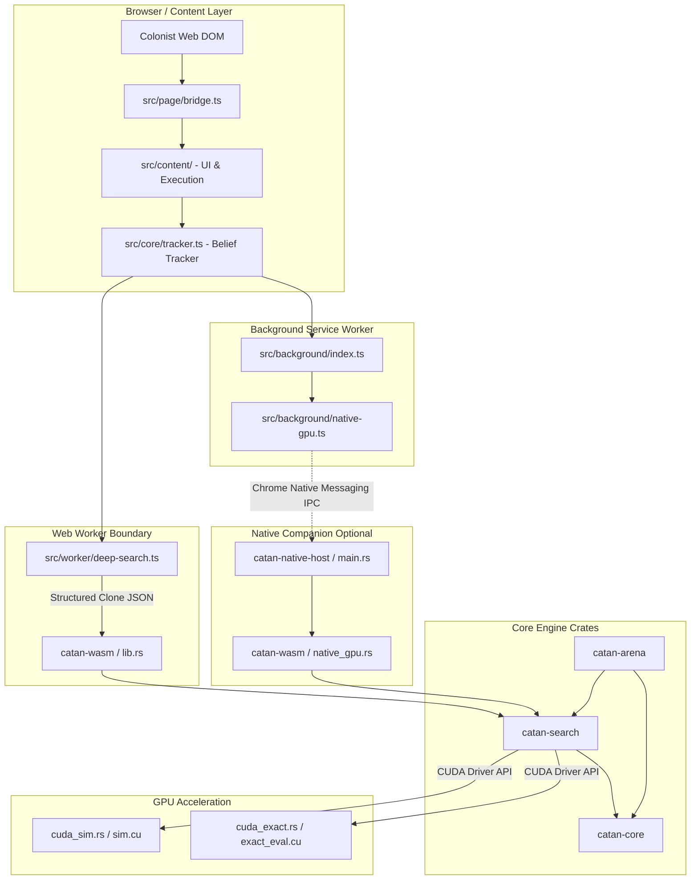
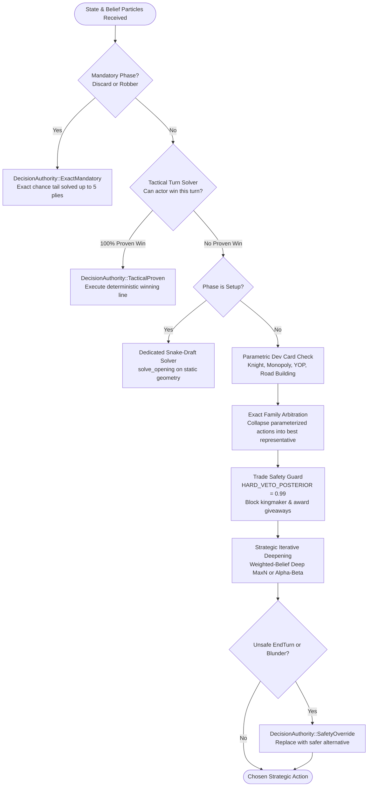

# Colonist Assistant Game Engine: Architecture & Design Review

> [!NOTE]
> **Status:** Ground-truth baseline review (corrected against current repository implementation, active configuration flags, and test binaries).

---

## 1. Executive Summary & Mission Context

The **Colonist Assistant** game engine is a clean-room implementation of 2–4 player base Settlers of Catan designed for real-time in-browser advisory and autonomous decision execution.

The engine operates under strict production constraints:
- **Zero Illicit Information Access:** Operates strictly within player-observable data without WebSocket interception, memory sniffing, or unearned server knowledge.
- **Honest Imperfect-Information Modeling:** Tracks joint belief distributions over opponent hand compositions and unplayed development cards via weighted particle filtering.
- **Multi-Tiered Decision Authority:** Implements a strict priority pipeline—avoiding heavy combinatorial search when actions are structurally forced, tactically proven, exact-family dominated, or subject to safety replacement.
- **Heterogeneous Dual Execution (WASM & Native CUDA):** Runs within browser WebAssembly workers under interactive latency budgets (2.0s live, 2.5s opening, 3.0s ponder), alongside an optional desktop companion utilizing native GPU acceleration (4.0s budget) for rollout searches and offline arena benchmarks.

---

## 2. Crate Architecture & System Boundaries

The engine is partitioned across five core Rust crates in [`engine/crates/`](file:///home/hamza/repo/colonist-assistant/engine/crates/) alongside a TypeScript browser extension orchestration layer:

### 2.1 Component Breakdown

1. **[`catan-core`](file:///home/hamza/repo/colonist-assistant/engine/crates/catan-core/src/lib.rs): Deterministic State & Rules**
   - Implements game rules, axial grid hex geometry, vertex/edge dual topologies, port coastlines, dice mechanics, robber resolution, domestic/maritime trading, and building placement.
   - Provides observation isolation ([`observed_state(observer)`](file:///home/hamza/repo/colonist-assistant/engine/crates/catan-core/src/state.rs#L562-L582) and `public_hash()`) ensuring simulated opponents and policy estimators do not condition on hidden third-party identities.
   - Utilizes scratch branching ergonomics ([`clone_from_and_apply`](file:///home/hamza/repo/colonist-assistant/engine/crates/catan-core/src/state.rs#L676-L687)) to minimize state allocation overhead during edge traversal.

2. **[`catan-search`](file:///home/hamza/repo/colonist-assistant/engine/crates/catan-search/src/lib.rs): Search & Strategic Reasoning**
   - Coordinates multi-player tree search (Deep MaxN and Paranoid Alpha-Beta), Monte Carlo Tree Search (PUCT), tactical current-turn solvers, exact chance-tail evaluation, heuristic evaluation, and opponent threat anticipation.
   - Evaluates leaf utilities via a comprehensive domain heuristic. (Note: neural evaluation weights exist in [`model_weights.rs`](file:///home/hamza/repo/colonist-assistant/engine/crates/catan-search/src/model_weights.rs), but `VALUE_MODEL_PROMOTED` and `POLICY_MODEL_PROMOTED` are currently `false`, so live production search relies on heuristic evaluation).

3. **[`catan-wasm`](file:///home/hamza/repo/colonist-assistant/engine/crates/catan-wasm/src/lib.rs): Browser Boundary**
   - Serializes and deserializes structured game state snapshots, validates DOM-derived constraints, enforces wall-clock deadlines via [`CooperativeDeadline`](file:///home/hamza/repo/colonist-assistant/engine/crates/catan-search/src/deadline.rs#L6-L32), and emits audit provenance traces.

4. **[`catan-arena`](file:///home/hamza/repo/colonist-assistant/engine/crates/catan-arena/src/lib.rs): Tournament & Verification Harness**
   - Headless benchmarker running reproducible 2–4 player matches with seat rotations, matched board/dice seeds, takeover experiments, and CPU/GPU parity regression suites.

5. **[`catan-native-host`](file:///home/hamza/repo/colonist-assistant/engine/crates/catan-native-host/src/main.rs): Native Messaging Companion**
   - High-speed IPC bridge communicating with [`src/background/native-gpu.ts`](file:///home/hamza/repo/colonist-assistant/src/background/native-gpu.ts) via standard I/O length-prefixed JSON frames, enabling the extension to delegate search to local CUDA hardware.

---

## 3. Decision Architecture & Authority Hierarchy

Decisions in [`catan-wasm`](file:///home/hamza/repo/colonist-assistant/engine/crates/catan-wasm/src/lib.rs) and [`catan-search`](file:///home/hamza/repo/colonist-assistant/engine/crates/catan-search/src/lib.rs) pass through an explicit **Decision Authority Pipeline**:

### 3.1 Authority Tiers

| Tier | Authority Name | Component | Functionality & Rationale |
| :--- | :--- | :--- | :--- |
| **1** | `ExactMandatory` | [`exact.rs`](file:///home/hamza/repo/colonist-assistant/engine/crates/catan-search/src/exact.rs#L80-L113) | Resolves forced moves (discards on 7, robber placement) with a complete chance-tail rollout (up to 5 plies) evaluating steal probabilities without full minimax search. |
| **2** | `TacticalProven` | [`tactical.rs`](file:///home/hamza/repo/colonist-assistant/engine/crates/catan-search/src/tactical.rs#L28-L112) | Explores same-turn build, trade, and dev-card combinations. If a deterministic 100% win sequence exists under current resources, it immediately yields that line. |
| **3** | `ExactFamily` | [`exact.rs`](file:///home/hamza/repo/colonist-assistant/engine/crates/catan-search/src/exact.rs#L25-L33) | Parameterized dev cards (e.g. 5 monopoly targets, 15 Year-of-Plenty pairs, robber victims) are resolved across all posterior particles to select a single dominant candidate before root branch competition. |
| **4** | `DeepMaxN` / `AlphaBeta` | [`depth.rs`](file:///home/hamza/repo/colonist-assistant/engine/crates/catan-search/src/depth.rs#L884-L1070) | Strategic engine backing up an $N$-player payoff vector $[V_0, V_1, V_2, V_3]$ across depth waves with iterative deepening under strict cooperative deadline monitoring. |
| **5** | `SafetyOverride` | [`trade_safety.rs`](file:///home/hamza/repo/colonist-assistant/engine/crates/catan-search/src/trade_safety.rs) / [`mcts.rs`](file:///home/hamza/repo/colonist-assistant/engine/crates/catan-search/src/mcts.rs#L204) | Overrides search when a hard constraint is triggered: vetoing domestic trades (`HARD_VETO_POSTERIOR = 0.99`) that hand an opponent a win/award, or replacing an unsafe `EndTurn` via [`safer_end_turn_alternative()`](file:///home/hamza/repo/colonist-assistant/engine/crates/catan-search/src/mcts.rs#L204). |

---

## 4. Evaluation Function & Strategic Knowledge

The leaf evaluator ([`catan-search/src/eval.rs`](file:///home/hamza/repo/colonist-assistant/engine/crates/catan-search/src/eval.rs)) computes a multi-player strategic utility vector balancing material, geometry, dynamic scarcity, and tempo:

### 4.1 Heuristic Feature Dimensions

1. **Production Pips & Dynamic Scarcity:** Hex dice numbers are weighted by pip frequency ($2 \dots 12$). Pips are dynamically re-weighted based on player hand deficits, building costs, and whether the hex is currently blocked by the robber ($0.12\times$ residual).
2. **Expansion Options & Route Portfolio:**
   - Precomputes shortest-path Dijkstra distance maps (`all_route_maps`) from the player's road network to unbuilt vertices.
   - Evaluates vertex expansion candidates by production gain, port synergy, road investment required, and survival probability (likelihood of an opponent settling the site first).
3. **Trophy Outlook (Awards):**
   - Continuous estimators for **Longest Road** and **Largest Army** pricing acquisition/retention probabilities and marginal road/knight gaps.
4. **Robber Denial:**
   - Evaluates robber hexes via leader-denial scoring, weighting leader production disruption higher than trailing opponents.
5. **Bank Depletion & Port Multipliers:**
   - Adjusts resource valuations based on visible bank scarcity and the player's maritime port trading ratios ($2:1$, $3:1$, $4:1$).
6. **Learned Model Infrastructure:**
   - Code and architecture support blending heuristic evaluation with a trained neural value network (`model_weights.rs`). Because `VALUE_MODEL_PROMOTED: bool = false`, production builds currently evaluate via the domain heuristic.

---

## 5. Imperfect Information & Belief Representation

Catan features substantial hidden state: opponent resource hands, face-down development cards, and the remaining deck composition.

### 5.1 Particle-Based Belief Handling

1. **Stratified Posterior Sampling:**
   - The TypeScript belief tracker ([`src/core/tracker.ts`](file:///home/hamza/repo/colonist-assistant/src/core/tracker.ts)) observes dice rolls, harvests, trades, steals, and dev-card purchases.
   - In live mode, [`src/worker/deep-search.ts`](file:///home/hamza/repo/colonist-assistant/src/worker/deep-search.ts) supplies a stratified sample capped at 24 particles (with offline support for larger cohorts like 48 or 96).
2. **Lossless Coalescing in Search:**
   - Upon receiving the particles, Rust production search canonicalizes them and coalesces exact-duplicate states by summing their posterior weights ([`coalesce_identical_particles`](file:///home/hamza/repo/colonist-assistant/engine/crates/catan-search/src/shared.rs#L7-L35)).
   - Production search **preserves all distinct supplied particles**; it does not truncate them to a smaller strategic coreset unless explicit experimental limits are configured.
3. **Information-Set Preservation:**
   - Simulated opponents decide actions using [`observed_state(player)`](file:///home/hamza/repo/colonist-assistant/engine/crates/catan-core/src/state.rs#L562-L582), redacting opponent card identities to public counts to prevent simulated opponents from exploiting hidden private hands.

---

## 6. Native GPU Acceleration & Parity Verification

The engine contains an optional CUDA simulation and search pipeline ([`cuda_sim.rs`](file:///home/hamza/repo/colonist-assistant/engine/crates/catan-search/src/cuda_sim.rs) and [`cuda/sim.cu`](file:///home/hamza/repo/colonist-assistant/engine/crates/catan-search/src/cuda/sim.cu)):

- **State Representation:** Game states are packed into flat integer words (`STATE_WORDS`) designed for GPU thread execution.
- **Parity Verification Harness:**
  - Bit-exact parity is continuously verified against designated regression corpora using dedicated binaries:
    - `cuda-sim-parity`: verifies step-by-step state transition and legality parity.
    - `exact-gpu-parity`: checks exact evaluation and chance tail consistency.
    - `cuda-sim-bulk-parity`: validates large-scale randomized batch transitions.
- **Root Rollout Acceleration:** Allows launching tens of thousands of parallel rollouts across candidate roots to evaluate branches with statistical confidence intervals.

---

## 7. Memory & Performance Profile

- **Memory Usage:** While the engine avoids heap reallocation during basic state transitions via `clone_from_and_apply()`, inner search loops still allocate dynamic collections (`Vec`, `HashMap`, ranking structures, and cloned particle states).
- **Time Budgets:**
  - `LIVE_WASM_TRADE_DECISION_TIME_MS`: 1,500 ms
  - `LIVE_WASM_DECISION_TIME_MS`: 2,000 ms
  - `LIVE_WASM_OPENING_DECISION_TIME_MS`: 2,500 ms
  - `LIVE_WASM_PONDER_DECISION_TIME_MS`: 3,000 ms
  - `NATIVE_GPU_DECISION_TIME_MS`: 4,000 ms
- Cooperative checkpoints ([`CooperativeDeadline`](file:///home/hamza/repo/colonist-assistant/engine/crates/catan-search/src/deadline.rs#L6-L32)) ensure the search yields control cleanly before browser or native timeouts occur.
